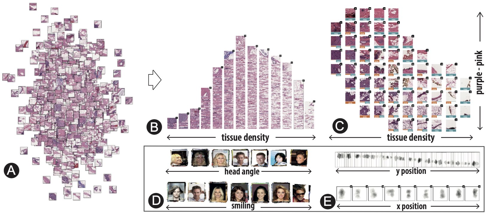

# DRAVA

<!-- TODO: add a gif here -->

**DRAVA** is an tool that utilizes <ins>**D**</ins>isentangled <ins>**R**</ins>epresentation Learning as <ins>**A**</ins> <ins>**V**</ins>isual <ins>**A**</ins>nalytics Method for Pattern-based Data Exploration of small multiples.
While latent vectors extracted by machine learning models are widely used to organize and explore data (e.g., layout data items based on their latent vectors in a 2D space using t-SNE), they usually suffer from a lack of interpretability. 
Disentangled representation learning (DRL) alleviates this issue by learning vectors that encode concepts in separated dimensions and are therefore more interpretable.
Even though promising, it can be challenging to apply these disentangled vectors due to the imperfections of algorithms and our limited understanding of how to support DRL-based visual exploration.
To address this problem, we propose a three-step workflow where users 1) understand ML-learned concepts, 2) refine and align ML concepts with human concepts, and 3) generate new knowledge about the analyzed data through concept-driven exploration.
We support this three-step workflow by providing a set of interactions based on visual piles and enhancing the DRL model with a concept adaptor that fine-tunes concept quality based on human feedback.
Interactive visual piles enable users to effectively organize, summarize, and compare groups of items based on human-readable concepts. 
The concept adaptor assists users in modifying potential imperfect semantic vectors and better facilitates concept-driven exploration.

For more information, please check out our [OSF reprint](https://osf.io/gzu27/) and [BioVis Presentation Video](https://drive.google.com/file/d/1-_5kkyez79Y2OvzOUrLeYJp0C-mv0XM6/view?usp=sharing)

<figure>
    
    <figcaption> <b>Drava extracts explainable concepts using disentangled representation learning to enable concept-driven exploration of small multiples.</b> (A) UMAP
projection of image patches of breast cancer specimens. (B) All image patches are organized and piled up based on the tissues density.
(C) All image patches are grouped into a grid layout according to the tissue density and the tissue color. The two visual concepts reveal
a strong association of the presentation of invasive ductal carcinomas (IDC), i.e., the orange label. (D-E) More examples. </figcaption>
</figure>

